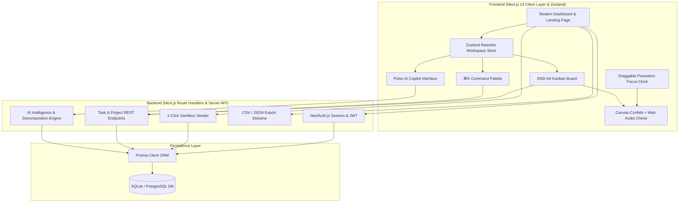
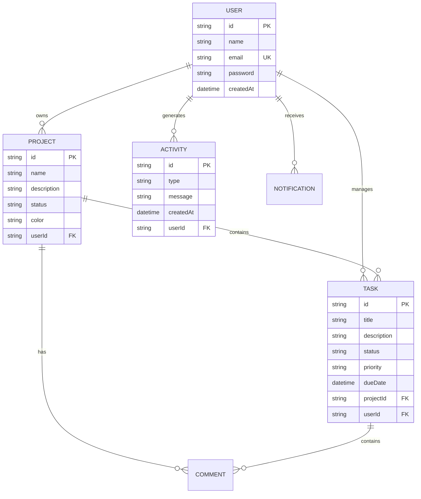

# ⚡ Pulse — High-Velocity Engineering Workspace & AI Copilot

<div align="center">


[](https://nextjs.org/)
[](https://www.typescriptlang.org/)
[](https://tailwindcss.com/)
[](https://www.prisma.io/)
[](https://next-auth.js.org/)
[](LICENSE)

**An AI-augmented project intelligence platform built for modern engineering teams.**  
*Combines fluid Kanban workflows, deep-work Pomodoro intervals, spotlight command palettes, and real-time velocity analytics.*

[🚀 Explore 1-Click Live Demo](#-live-demo--recruiter-sandbox) • [✨ Key Differentiators](#-what-makes-pulse-different) • [🏗️ Architecture](#️-system-architecture) • [⚡ Quickstart](#-getting-started)

</div>

---

## 🌟 Overview

**Pulse** is a modern SaaS engineering management workspace engineered with **Next.js 14 App Router**, **TypeScript**, **Tailwind CSS**, and **Prisma ORM**. It solves the clutter of traditional task trackers by blending **AI-driven task decomposition**, **spotlight keyboard control (`⌘K`)**, **built-in deep work focus tools**, and **instant sprint velocity telemetry**.

Whether you're managing complex sprint roadmaps, coordinating cross-functional milestones, or staying in deep work flow, Pulse brings speed, precision, and visual excellence to every interaction.

---

## 🚀 Live Demo & Recruiter Sandbox

Test the platform instantly with zero setup or registration friction:

- **1-Click Sandbox**: Click **"Try Live Demo"** on the landing page or login page to auto-login as a guest with pre-populated workspaces, tasks, and audit logs.
- **Demo Credentials**:
  - **Email**: `demo@pulse.io`
  - **Password**: `demopassword123`

---

## ✨ What Makes Pulse Different?

### 1. 🧠 Pulse AI Copilot 2.0 & Smart Estimator
- **Goal & Feature Decomposition**: Enter high-level roadmap goals (e.g. *"Build OAuth 2.0 with 2FA and Audit Logs"*), and Pulse AI decomposes them into prioritized, sprint-ready tasks with time estimates.
- **Inline AI Priority & Effort Predictor**: Analyzes task titles in real-time to suggest urgency levels, tags (`#Backend`, `#Security`, `#Bugfix`), and estimated hours.
- **Sprint Health & Workload Audit**: Real-time velocity scoring algorithm that computes project risk ratios, context switching alerts, and completion momentum.
- **Standup Report Generator**: Instantly drafts your daily standup update based on active tickets in your sprint pipeline.

### 2. 🎙️ Web Speech Voice Dictation Engine
- Built-in speech-to-text dictation using the **Web Speech API** with audio pulse indicator for hands-free task creation, spotlight queries, and AI conversations.

### 3. ⚡ Spotlight Command Palette (`⌘K`) & Cheatsheet (`?`)
- Omnipresent search modal allowing power users to navigate projects, search tickets, toggle themes, and trigger sprint actions without taking their hands off the keyboard.
- Press `?` anywhere to open the interactive keyboard shortcut cheatsheet.

### 4. 📋 Interactive Task Detail Drawer & Discussion Threads
- **Granular Subtask Checklist**: Break tasks into actionable checklist items with dynamic percentage progress calculation.
- **Task Discussion Threads**: Threaded comments with timestamps, user avatars, and instant feedback.

### 5. 🎯 Fluid Drag-and-Drop Kanban with Multi-Sensory Celebration Engine
- Smooth accessible drag-and-drop powered by `@dnd-kit`.
- Dual-trigger celebration engine:
  - **Physics Particle Bursts**: Powered by `canvas-confetti` with multi-angle confetti cannons.
  - **Synthesized Harmonic Chime**: Native **Web Audio API** (`AudioContext`) playing a crisp 4-note upward major arpeggio (C5 → E5 → G5 → C6) upon task completion, subtask 100% completion, and Pomodoro focus intervals.
- Real-time task filtering by keyword, priority, and date range.

### 6. ⏱️ Free-Floating Draggable Pomodoro Focus Timer
- Fully draggable productivity clock anywhere across the viewport with boundary clamping and cursor grabbing physics.
- 25m Focus / 5m Short Break / 15m Long Break intervals with real-time session telemetry.

### 7. ⚡ Reactive Global State with Zustand
- Ultra-lightweight reactive client store (`useWorkspaceStore`) coordinating spotlight dialogs, active task drawers, AI copilot context, and optimistic task updates across components without prop drilling.

### 8. 📊 Velocity Analytics & Real-Time Sync Telemetry
- Interactive charts powered by `Recharts` visualizing weekly completion velocity, priority distribution matrices, and pipeline health scores.
- Recharts dark mode contrast calibration with dynamic theme tooltips and zero illegible text.
- Live database query latency indicator (`Sync: 12ms`).

### 9. 🎨 Modern Color Harmony & Custom Avatar Engine
- Modern indigo/violet, emerald, amber, and rose accents replacing generic monochrome palettes.
- Custom avatar uploader with drag-and-drop image upload, instant base64 preview, and persistence.
- Optional subtask creation workflow: add subtasks on-demand without unwanted phantom default items.

### 10. 📤 Multi-Format Export Engine
- One-click export of sprint boards to **CSV**, **JSON**, or formatted **Markdown** for instant sharing in team standups or Slack/Discord.

---

## 🏗️ System Architecture



---

## 📊 Database Schema (ERD Overview)



---

## ⌨️ Power-User Keyboard Shortcuts

| Shortcut | Action | Scope |
|---|---|---|
| `⌘K` / `Ctrl+K` | Open Spotlight Command Palette | Global |
| `↑` / `↓` | Navigate Spotlight items | Command Palette |
| `Enter` | Select / Execute item | Command Palette |
| `N` | Create new task modal | Project Board |
| `Esc` | Close modal / dialog | Global |
| `Drag & Drop` | Reorder task status column or reposition timer | Kanban / Viewport |

---

## 🛠️ Tech Stack & Engineering Highlights

| Layer | Technology | Rationale |
|---|---|---|
| **Framework** | **Next.js 14 (App Router)** | Server-side rendering, API route handlers, optimized bundle size. |
| **Language** | **TypeScript 5.3** | End-to-end type safety, strict schemas, robust refactoring. |
| **Global State** | **Zustand** | Predictable, zero-boilerplate client state store with direct subscriber access. |
| **Styling** | **Tailwind CSS + shadcn/ui** | Design system tokenization, dark/light theme switching, glassmorphic UI. |
| **Database & ORM** | **Prisma 5 + SQLite** | Type-safe queries, migration control, zero external cloud DB setup required. |
| **Celebration Engine**| **canvas-confetti + Web Audio API** | Dual physics-based confetti bursts & synthesized harmonic arpeggio chimes. |
| **Authentication** | **NextAuth.js v4** | JWT session strategies, encrypted credentials, seamless guest sandboxes. |
| **Interactive UX** | **@dnd-kit + Recharts + date-fns** | Accessible drag-and-drop, high-contrast SVG telemetry, and relative timestamps. |

---

## 💻 Getting Started

### Prerequisites
- Node.js 18.x or 20.x
- `pnpm`, `npm`, or `yarn`

### 1. Clone the repository
```bash
git clone git@github.com:Nirvik26/Pulse.git
cd Pulse
```

### 2. Install dependencies
```bash
pnpm install
# or
npm install
```

### 3. Environment Variables
Create a `.env` file in the root directory:
```env
DATABASE_URL="file:./dev.db"
NEXTAUTH_URL="http://localhost:3000"
NEXTAUTH_SECRET="your-super-secret-jwt-key-here-32-chars-long"
```

### 4. Setup Database
```bash
pnpm db:push
# or
npx prisma db push
```

### 5. Start Development Server
```bash
pnpm dev
# or
npm run dev
```

Open [http://localhost:3000](http://localhost:3000) in your browser to view Pulse.

---

## 📂 Project Directory Structure

```
Pulse/
├── prisma/
│   ├── schema.prisma         # Prisma data models & relations
│   └── dev.db                # SQLite local database
├── src/
│   ├── app/
│   │   ├── api/              # Route handlers (chat, tasks, projects, demo-login, export)
│   │   ├── dashboard/        # Authenticated workspace routes
│   │   │   ├── activity/     # Audit activity stream
│   │   │   ├── calendar/     # Due date scheduling view
│   │   │   ├── notifications/# Notifications center
│   │   │   ├── projects/     # Kanban board & project manager
│   │   │   └── settings/     # User profile & theme settings
│   │   ├── login/            # Authentication & 1-click sandbox
│   │   ├── register/         # User signup
│   │   ├── globals.css       # Tailwind CSS variables & design tokens
│   │   ├── layout.tsx        # Root HTML layout with providers
│   │   └── page.tsx          # High-converting SaaS landing page
│   ├── components/
│   │   ├── chatbot.tsx       # Pulse AI Copilot 2.0 interface
│   │   ├── command-palette.tsx # Global ⌘K spotlight search
│   │   ├── confetti.tsx      # Canvas celebration particle effect
│   │   ├── focus-timer.tsx   # Pomodoro productivity clock widget
│   │   ├── header.tsx        # Dashboard navigation header
│   │   ├── pulse-mark.tsx    # Animated brand logo mark
│   │   ├── sidebar.tsx       # Collapsible navigation drawer
│   │   └── ui/               # Modular shadcn/ui components
│   ├── lib/
│   │   ├── auth.ts           # NextAuth configuration
│   │   ├── db.ts             # Prisma singleton client
│   │   └── utils.ts          # Classname & styling utilities
│   ├── store/
│   │   └── useWorkspaceStore.ts # Central Zustand workspace store
└── package.json
```

---

## 👨‍💻 Author & Portfolio

**Nirvik**  
- **GitHub**: [@Nirvik26](https://github.com/Nirvik26)
- **Project Repository**: [https://github.com/Nirvik26/Pulse](https://github.com/Nirvik26/Pulse)

*Constructed with passion for clean software architecture, intuitive developer experience, and delightful micro-interactions.*

---

## 📄 License

This project is licensed under the [MIT License](LICENSE).
